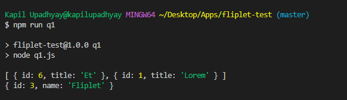
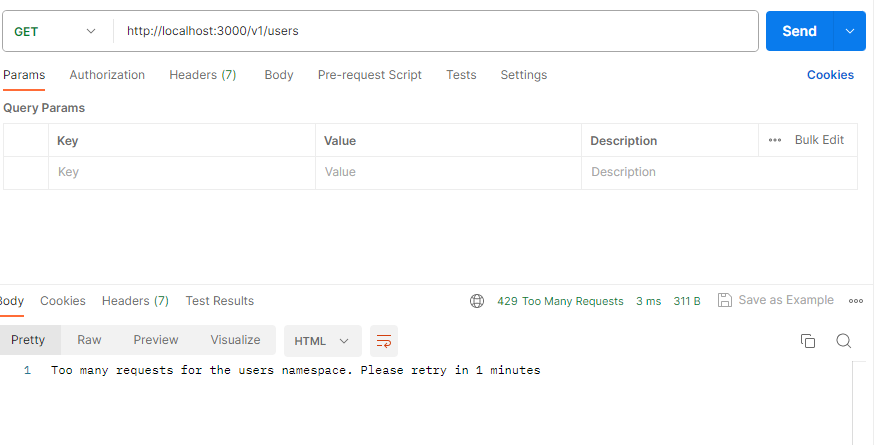
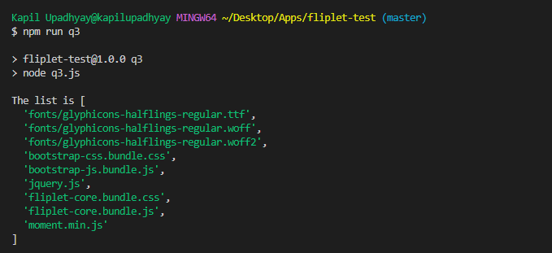

# Fliplet-Test Project - Questions and Answers

This repository contains a Fliplet-Test Project with a collection of questions and answers. Each question is accompanied by a corresponding answer screenshot.

## Questions and Answers

### Question 1 : Advanced use of Javascript

The answer to Question 1 can be found in the `q1.js` file.

### Question 2 : Implement an Express.js middleware

The answer to Question 2 can be found in the `q2.js` file.

### Question 3 : Functional programming

The answer to Question 3 can be found in the `q3.js` file.

## Usage

To run the Project and view the answers, follow these steps:

1. Install the required dependencies by running `npm install`.
2. Execute each question file separately by running `npm run q1`, `npm run q2`, `npm run q3`
3. The answer along with any additional output will be displayed in the console.

Feel free to explore the code and modify it according to your needs.
